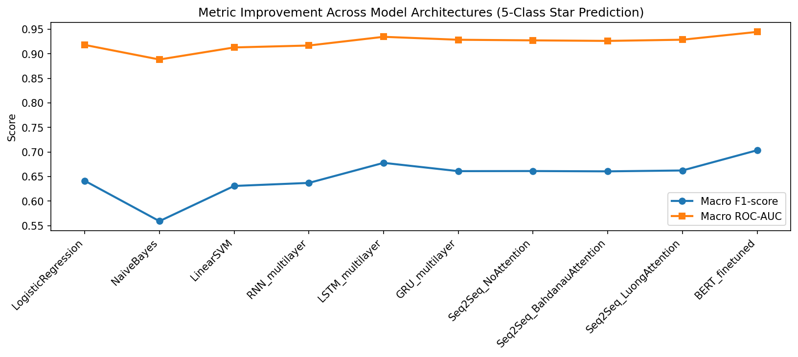
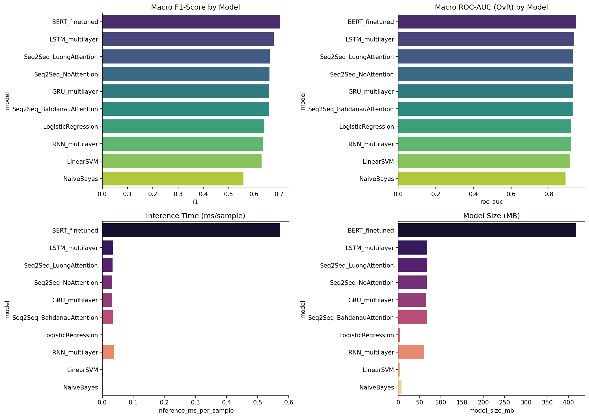
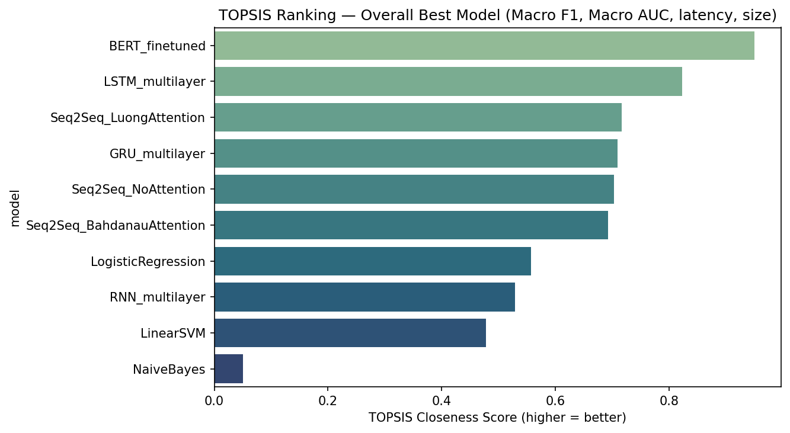
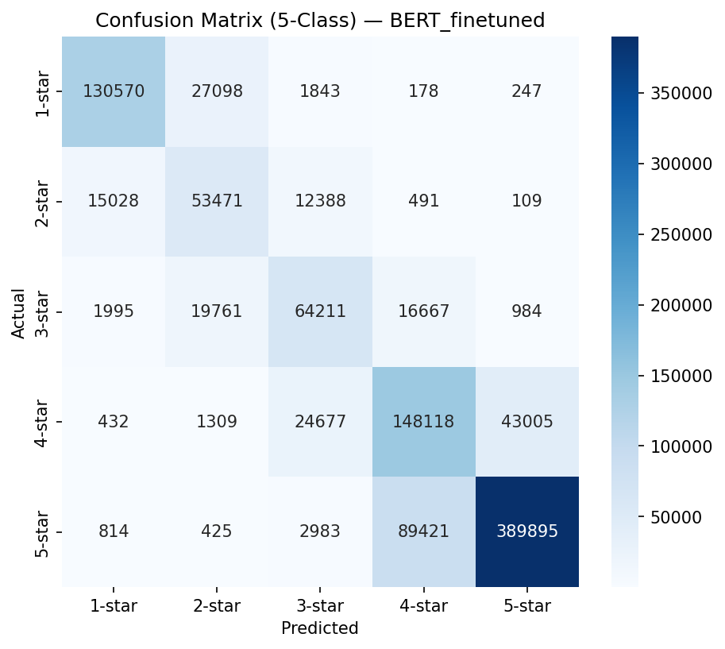
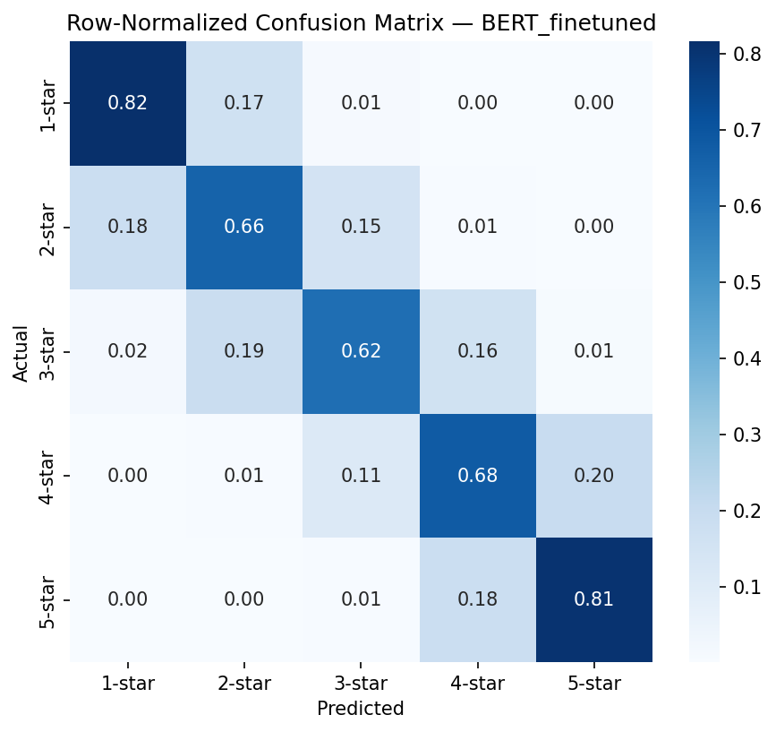
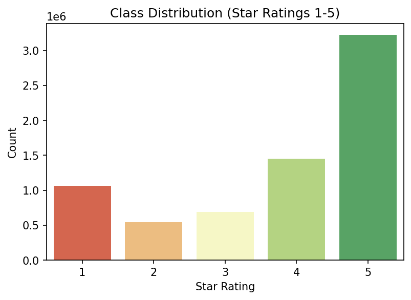
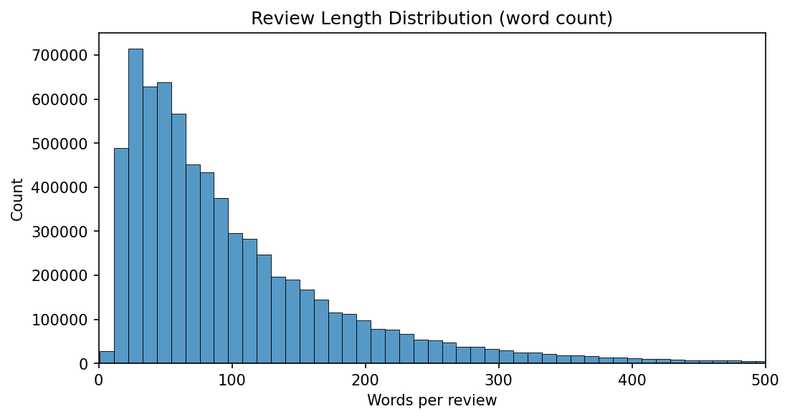
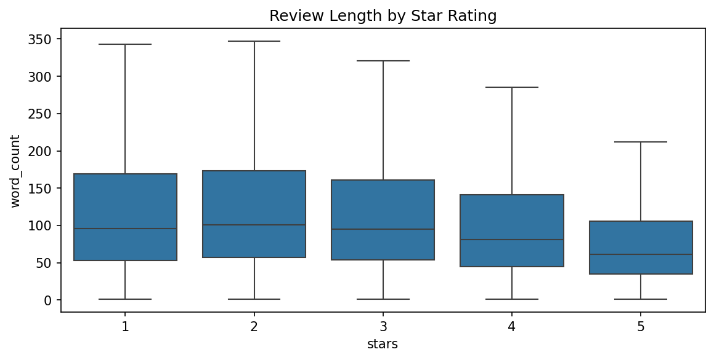
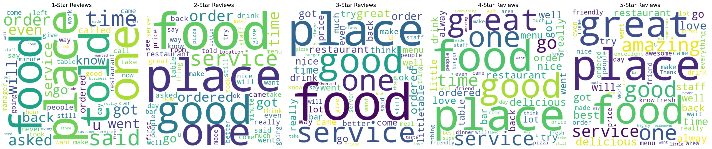

# SentimentIQ

**A large-scale benchmark of 10 machine learning and deep learning architectures — from classical ML to fine-tuned Transformers — for multiclass sentiment prediction on 7 million real-world reviews.**

Beyond raw accuracy, this project introduces a **TOPSIS-based multi-criteria ranking system** that weighs predictive performance against real-world deployment costs (inference latency, model size) — revealing a genuine quality-vs-efficiency tradeoff between transformer-based and classical sequence models.

**Trained model weights:** hosted separately on [HuggingFace Hub](https://huggingface.co/Rhumeet/sentimentiq-weights) due to file size (excluded from this repository).

---

## Table of Contents

- [Overview](#overview)
- [Pipeline](#pipeline)
- [Results](#results)
- [Repository Structure](#repository-structure)
- [Reproducing This Project](#reproducing-this-project)
- [Tech Stack](#tech-stack)
- [Limitations & Future Work](#limitations--future-work)
- [Dataset License Note](#dataset-license-note)
- [License](#license)

---

## Overview

- **Task:** 5-class star rating prediction (1–5) from raw review text
- **Dataset:** [Yelp Open Dataset](https://www.yelp.com/dataset) — approximately 7,000,000 business reviews, full dataset used with no subsampling
- **Models compared (10):** Logistic Regression, Naive Bayes, Linear SVM, RNN, LSTM, GRU (all multi-layer, bidirectional), Seq2Seq (no attention), Seq2Seq with Bahdanau Attention, Seq2Seq with Luong Attention, and fine-tuned BERT
- **Hardware:** Trained end-to-end on an NVIDIA H100 GPU using automatic mixed-precision (AMP) training

## Pipeline

1. **Exploratory Data Analysis** — class distribution across star ratings, review length distribution, per-class word frequency analysis, word clouds
2. **Preprocessing** — negation-preserving text cleaning, stratified 70/15/15 train/validation/test split
3. **Class-imbalance handling** — inverse-frequency class weighting applied consistently across every trainable model (`class_weight="balanced"` for scikit-learn models, weighted `CrossEntropyLoss` for all deep learning models)
4. **Model training** — all 9 deep learning models trained with early stopping based on validation macro-F1 and adaptive learning-rate scheduling (`ReduceLROnPlateau`); best checkpoint weights saved per model
5. **Evaluation** — macro-averaged Precision, Recall, and F1, multiclass ROC-AUC (one-vs-rest), training time, inference latency, and model size, logged to a unified metrics table
6. **TOPSIS ranking** — min-max normalized multi-criteria ranking evaluated under two weighting schemes (quality-focused and efficiency-focused), correctly handling criteria that span multiple orders of magnitude (model size ranges from 3.8 MB to 417.7 MB across models)
7. **Error analysis** — confusion matrices, adjacent-versus-distant misclassification breakdown, and qualitative inspection of misclassified reviews

## Results

### Full Metrics Table

| Model | Accuracy | Precision | Recall | Macro F1 | ROC-AUC | Train Time | Inference (ms/sample) | Model Size |
|---|---|---|---|---|---|---|---|---|
| **BERT (fine-tuned)** | 0.752 | 0.697 | 0.716 | **0.703** | **0.945** | 11.04 hrs | 0.572 | 417.7 MB |
| LSTM (multi-layer) | 0.737 | 0.671 | 0.687 | 0.678 | 0.935 | 46.2 min | 0.034 | 68.6 MB |
| Seq2Seq + Luong Attention | 0.715 | 0.655 | 0.676 | 0.662 | 0.929 | 29.6 min | 0.033 | 68.4 MB |
| Seq2Seq (No Attention) | 0.717 | 0.656 | 0.672 | 0.661 | 0.927 | 28.4 min | 0.031 | 67.1 MB |
| GRU (multi-layer) | 0.717 | 0.656 | 0.671 | 0.661 | 0.929 | 36.1 min | 0.032 | 66.0 MB |
| Seq2Seq + Bahdanau Attention | 0.722 | 0.652 | 0.671 | 0.660 | 0.926 | 37.4 min | 0.034 | 68.6 MB |
| Logistic Regression | 0.699 | 0.633 | 0.656 | 0.641 | 0.918 | 21.9 min | 0.001 | 3.8 MB |
| RNN (multi-layer) | 0.703 | 0.634 | 0.644 | 0.637 | 0.917 | 32.9 min | 0.037 | 60.8 MB |
| Linear SVM | 0.716 | 0.628 | 0.635 | 0.631 | 0.913 | 44.7 min | 0.001 | 3.8 MB |
| Naive Bayes | 0.673 | 0.575 | 0.554 | 0.559 | 0.888 | 0.1 min | 0.001 | 7.6 MB |

*All models evaluated on an identical held-out test split.*

### Metric Progression Across Architectures

Performance climbs consistently from classical ML through sequential deep learning to attention-augmented models and, finally, fine-tuned BERT — illustrating the value of increasing architectural capacity for a task with genuinely ambiguous, adjacent-class boundaries (for example, 3-star versus 4-star reviews).





### TOPSIS Multi-Criteria Ranking

Rather than naively selecting the highest-F1 model, this project ranks all 10 models using **TOPSIS** (Technique for Order Preference by Similarity to Ideal Solution) across four weighted criteria: macro F1, macro ROC-AUC, inference latency, and model size.



- **Quality-weighted ranking:** BERT ranks **#1** (score 0.950) — the best raw predictive performance
- **Efficiency-weighted ranking:** LSTM ranks **#1** (score 0.850), with BERT falling to **#9** (score 0.505) — BERT's approximately 2.5-point F1 advantage does not offset being roughly 17 times slower at inference and roughly 6 times larger

This reveals a genuine, defensible tradeoff: **BERT is the right choice when predictive quality is paramount; LSTM is the right choice under latency or resource constraints** — exactly the kind of nuanced tradeoff a real deployment decision requires.

### Error Analysis

BERT's confusion matrix shows that misclassifications are concentrated in **adjacent star ratings** (for example, a 4-star review predicted as 3-star or 5-star) rather than distant, random errors — consistent with genuine linguistic ambiguity in mixed-sentiment reviews rather than model failure.





Of all misclassifications, **24.84%** were adjacent-class confusions on the best-performing model, validated through manual inspection of misclassified reviews (for example, reviews with mixed sentiment such as "food is good, but service was slow").

### Exploratory Data Analysis



The dataset is heavily skewed toward 5-star reviews — a real-world imbalance pattern that motivated the class-weighting strategy applied across every model.







## Repository Structure
```
SentimentIQ/
├── sentiment_analysis_yelp.ipynb # Full pipeline: EDA, preprocessing, training, TOPSIS, error analysis
├── outputs/
│ ├── model_metrics.csv # Logged metrics for all 10 models
│ ├── eda_class_balance.png
│ ├── eda_length_dist.png
│ ├── eda_length_by_class.png
│ ├── eda_wordclouds.png
│ ├── metrics_comparison.png
│ ├── metric_progression.png
│ ├── topsis_ranking.png
│ ├── best_model_confusion_matrix.png
│ └── best_model_confusion_matrix_normalized.png
├── .gitignore
├── LICENSE
└── README.md
```

Trained model weights (`.pt` and `.pkl` files, approximately 833 MB total) are not stored in this repository due to GitHub file size limits, and are instead hosted on [HuggingFace Hub](https://huggingface.co/Rhumeet/sentimentiq-weights).

## Reproducing This Project

1. Download the [Yelp Open Dataset](https://www.yelp.com/dataset) (requires accepting Yelp's terms of use) and extract `yelp_academic_dataset_review.json`
2. Install dependencies:
```bash
   pip install transformers torch scikit-learn pandas numpy matplotlib seaborn wordcloud tqdm
```
3. Set `YELP_JSON_PATH` in the notebook's configuration cell to point to the extracted JSON file
4. Run the notebook top to bottom (a GPU is strongly recommended; the full run takes several hours, primarily due to BERT fine-tuning)

## Tech Stack

Python · PyTorch · HuggingFace Transformers · scikit-learn · pandas · NumPy · Matplotlib · Seaborn

## Limitations & Future Work

- RNN-family embeddings were randomly initialized rather than pretrained (for example, GloVe), which likely understates their true potential relative to BERT's pretrained representations. A natural extension is comparing against pretrained embedding initialization.
- BERT was fine-tuned rather than built from scratch. Building a Transformer encoder from scratch would isolate the effect of self-attention from the effect of large-scale pretraining.
- Naive Bayes has no native class-weighting mechanism, so it could not be corrected for class imbalance the way other models were — a known, documented limitation of the algorithm itself, not a tuning gap.

## Dataset License Note

This repository does **not** include the Yelp dataset itself. The Yelp Open Dataset is subject to [Yelp's own terms of use](https://www.yelp.com/dataset) (educational use only, no redistribution) and must be downloaded separately by anyone reproducing this project.

## License

This project's code is licensed under the [MIT License](LICENSE).
